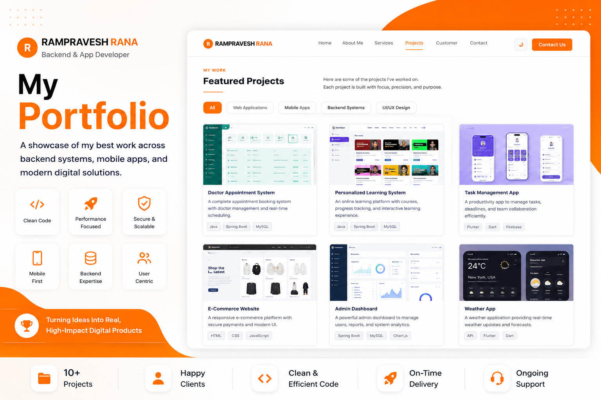

# Rampravesh Rana - Portfolio Website



A modern, responsive portfolio website showcasing my skills as a Java Backend & App Developer. Built with clean HTML, CSS, and JavaScript featuring dark/light theme toggle and smooth animations.

## 🚀 Live Demo

Visit my portfolio at: [https://rampraveshrana.vercel.app](https://rampraveshrana.vercel.app)

## 👨‍💻 About Me

Hi, I'm **Rampravesh Rana**, a passionate Java Backend & App Developer focused on building fast, reliable, and user-friendly applications. I specialize in creating scalable backend systems and smooth mobile experiences that combine performance with real-world functionality.

### Skills & Expertise

- **Java Backend Development** - Building secure and scalable backend systems
- **SpringBoot** - Creating robust REST APIs and microservices
- **Flutter Development** - Cross-platform mobile applications
- **App Development** - Android and iOS applications
- **UI/UX Design** - Clean and intuitive user interfaces

## 🎓 Education

- **BCA - AIML** (2023-2026) - Maharishi Markandeshwar University, Haryana
  - CGPA: 8.63
  - Focus: Java backend systems, app development, software engineering

- **12th Standard** (2023) - Ghaghra Inter Science College, Bagodar
  - Percentage: 82.60%
  - Stream: Science (Mathematics focus)

- **10th Standard** (2021) - Indira Gandhi High School, Fufandi
  - Percentage: 88.20%
  - Strong foundation in science and computer fundamentals

## 💼 Services

### Java Backend Development
Building secure and scalable backend systems with clean architecture and efficient APIs that deliver fast, reliable, and seamless application performance.

### Flutter Development
Beautiful, responsive mobile apps that deliver smooth performance, modern design, and engaging user experiences across all devices.

### App Development
Sleek and functional mobile applications for Android and iOS with smooth performance and exceptional attention to user experience.

### UI & UX Design
Clean and intuitive UI/UX designs that create smooth user experiences with a strong focus on usability and modern aesthetics.

## 📞 Contact

I'm available for freelance work and full-time opportunities. Let's discuss how we can work together!

- **Email**: rampraveshrana1435@gmail.com
- **LinkedIn**: [https://www.linkedin.com/in/rampravesh-rana-4b8409293](https://www.linkedin.com/in/rampravesh-rana-4b8409293)
- **GitHub**: [https://github.com/rampurirana](https://github.com/rampurirana)

## 🛠️ Technologies Used

### Frontend
- **HTML5** - Semantic markup and structure
- **CSS3** - Custom properties, Flexbox, Grid, animations
- **JavaScript (ES6+)** - Interactive functionality and DOM manipulation

### Libraries & Frameworks
- **Font Awesome** - Icons and visual elements
- **Google Fonts (Poppins)** - Typography
- **EmailJS** - Contact form functionality

### Features
- **Responsive Design** - Mobile-first approach
- **Dark/Light Theme** - Theme toggle with localStorage persistence
- **Smooth Animations** - CSS transitions and Intersection Observer API
- **Interactive Elements** - Hamburger menu, project filters, skill bars
- **Contact Form** - Functional contact form with validation

## 🚀 Getting Started

### Prerequisites

Before running this project locally, make sure you have the following installed:

- A modern web browser (Chrome, Firefox, Safari, Edge)
- A code editor (VS Code recommended)
- Git (for cloning the repository)

### Installation

1. **Clone the repository**
   ```bash
   git clone https://github.com/rampurirana/Rampravesh-Rana-Portfolio.git
   cd Rampravesh-Rana-Portfolio
   ```

2. **Open in browser**
   - Simply open `index.html` in your web browser
   - Or use a local development server

#### Using VS Code Live Server Extension
1. Install the "Live Server" extension in VS Code
2. Right-click on `index.html` and select "Open with Live Server"

Then visit `http://localhost:8000` (or the port shown in your terminal)

## 📁 Project Structure

Rampravesh-Rana-Portfolio/
│
├── index.html          # Main HTML file
├── style.css           # Stylesheet with CSS variables and themes
├── script.js           # JavaScript for interactivity
├── image/              # Image assets
│   ├── Rampraveh Rana.png    # Profile picture
│   ├── Portfolio.png          # Portfolio preview
│   ├── doctor.png             # Doctor appointment project
│   ├── Learning.png           # Learning system project
│   ├── Bank.png               # Bank management project
│   ├── Chatbot.png            # Chatbot project
│   └── Progress.png           # In progress project
│
└── README.md           # This file

### Contact Form Setup
The contact form uses EmailJS. To set it up:

1. Sign up at [EmailJS](https://www.emailjs.com/)
2. Create a service and email template
3. Update the service ID and template ID in `script.js`:
   ```javascript
   emailjs.sendForm('your_service_id', 'your_template_id', '#contactForm')
   ```
4. Add your public key to the initialization:
   ```javascript
   emailjs.init({
       publicKey: 'your_public_key',
   });
   ```

## 📱 Features

- **Responsive Design** - Works perfectly on desktop, tablet, and mobile
- **Dark/Light Mode** - Toggle between themes with persistence
- **Smooth Scrolling** - Navigation with offset for fixed header
- **Interactive Animations** - Fade-in effects and skill bar animations
- **Project Filtering** - Filter projects by category
- **Contact Form** - Functional contact form with validation
- **Mobile Menu** - Hamburger menu for mobile navigation
- **SEO Friendly** - Proper meta tags and semantic HTML

## 🤝 Contributing

This is a personal portfolio project, but suggestions and feedback are welcome! Feel free to:

1. Fork the repository
2. Create a feature branch
3. Make your changes
4. Submit a pull request

## 📄 License

This project is open source and available under the [MIT License](LICENSE).

## 🙏 Acknowledgments

- **Font Awesome** for the beautiful icons
- **Google Fonts** for the Poppins font family
- **EmailJS** for the contact form functionality
- **Unsplash/Pexels** for any stock images used

---

**Designed with ♥ & passion by Rampravesh Rana**

© 2026 Rampravesh Rana — All Rights Reserved.